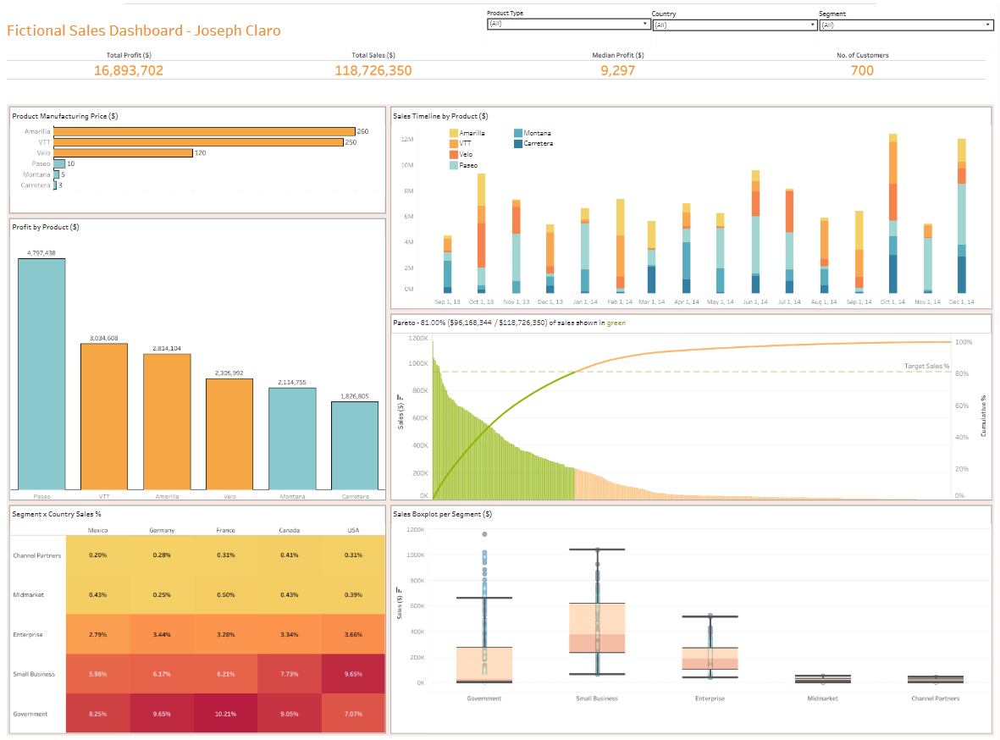

# Fictional-Sales-Dashboard v1
Interactive dashboard created in Tableau Public, summarising a fictitious international sales dataset. If you're familiar with Power BI you'll recognise the data as the sample dataset that comes with the software.

I worked on this project to develop my Tableau data analysis skills, as well as consider what features maximise a sales dashboard's utility.
The dashboard features summary statistics and KPIs for sales quantities and profit, based on product type, client sector and nationality. I've also included versatile filters for more focused drilldowns.

While I'm content with the final project and its formatting, I'd like to add more functionality to the Pareto chart, which orders each purchase by sales and gives the user an idea of how a "crucial minority" contribute to the majority of the profit. Additionally, the details in the chart don't update when filters are added, so that's what I want to address first in a v2.

Link to view on Tableau Public: https://public.tableau.com/views/FictionalCompanyFinancialsv1/Dashboard1

